# 🚀 Front-End Project Showcase

Welcome to my curated collection of **HTML5, CSS3, Flexbox, and Bootstrap 4** beginner-to-intermediate projects.  
Each project reflects my journey in mastering **responsive design**, **UI/UX best practices**, and **clean, maintainable code** — all while building visually engaging web interfaces.

---

## 🛠️ Skills & Focus

- **HTML5, CSS3, Flexbox, Bootstrap 4** — building responsive, modern web layouts  
- Strong emphasis on **clean code**, **semantic markup**, and **mobile-first design**  
- Projects showcase ability to implement **UI/UX best practices** and **interactive interfaces**  
- Continuously learning and applying **industry-standard front-end development techniques**

---

## 📂 Projects

| #  | Project Name         | Tags               | Tech Stack       | Live Demo                                         |
|----|----------------------|--------------------|------------------|--------------------------------------------------|
| 1  | Digital Agency       | `CSS3`             | HTML, CSS        | [🌐 Live](https://dineshtm07.github.io/DIGITAL-AGENCY-CSS/)       |
| 2  | Fashion Store        | `CSS3`             | HTML, CSS        | [🌐 Live](https://dineshtm07.github.io/FASHION-STORE-CSS/)        |
| 3  | Navbar Dark          | `CSS3`             | HTML, CSS        | [🌐 Live](https://dineshtm07.github.io/NAVBAR-DARK/)              |
| 4  | Pricing Tag          | `CSS3`             | HTML, CSS        | [🌐 Live](https://dineshtm07.github.io/PRICING-TAG-CSS/)          |
| 5  | Flexbox Landing Page | `Flexbox`          | HTML, CSS, Flexbox| [🌐 Live](https://dineshtm07.github.io/FLEXBOX-LANDING-PAGE/)     |
| 6  | Flexbox Landing Page 2| `Flexbox`          | HTML, CSS, Flexbox| [🌐 Live](https://dineshtm07.github.io/FLEEXBOX-LANDING-PAGE-2/) |
| 7  | Museum of Candy      | `Bootstrap 4`      | HTML, CSS, Bootstrap 4 | [🌐 Live](https://dineshtm07.github.io/MUSEUM-OF-CANDY/)         |
| 8  | Basic Gallery        | `HTML5`, `CSS3`    | HTML, CSS        | [🌐 Live](https://dineshtm07.github.io/BASIC-GALLERY/)            |
| 9  | Admin Dashboard      | `HTML5`, `CSS3`    | HTML, CSS        | [🌐 Live](https://dineshtm07.github.io/ADMIN-DASHBOARD/)          |
| 10 | Beginner Portfolio   | `HTML5`, `CSS3`    | HTML, CSS        | [🌐 Live](https://dineshtm07.github.io/BEG-PORTFOLIO/)            |
| 11 | Candy Baby           | `Bootstrap 4`      | HTML, CSS, Bootstrap 4 | [🌐 Live](https://dineshtm07.github.io/CANDY-BABY-BS4/)           |
| 12 | Candy Baby 2         | `Bootstrap 4`      | HTML, CSS, Bootstrap 4 | [🌐 Live](https://dineshtm07.github.io/CANDY-BABY2-BS4/)          |
| 13 | HTML Project Two     | `HTML5`, `CSS3`    | HTML, CSS        | [🌐 Live](https://dineshtm07.github.io/html-project-two/)         |
| 14 | HTML Project One     | `HTML5`, `CSS3`    | HTML, CSS        | [🌐 Live](https://dineshtm07.github.io/html-project-one/)         |

---

## 🖼️ Screenshots

| Project Name         | Screenshot                                       |
|----------------------|------------------------------------------------|
| Digital Agency       | 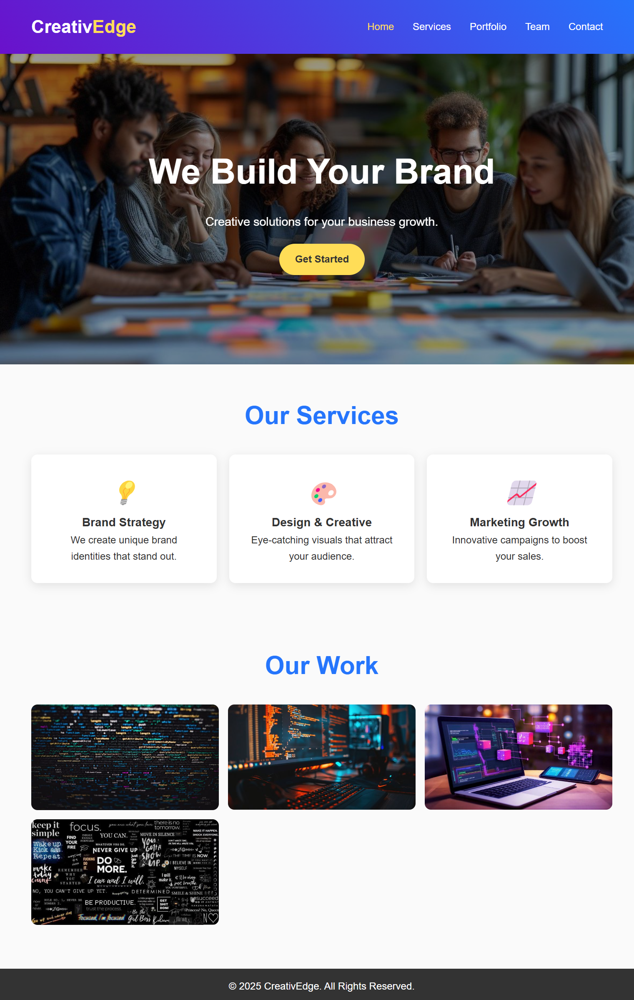 |
| Fashion Store        | 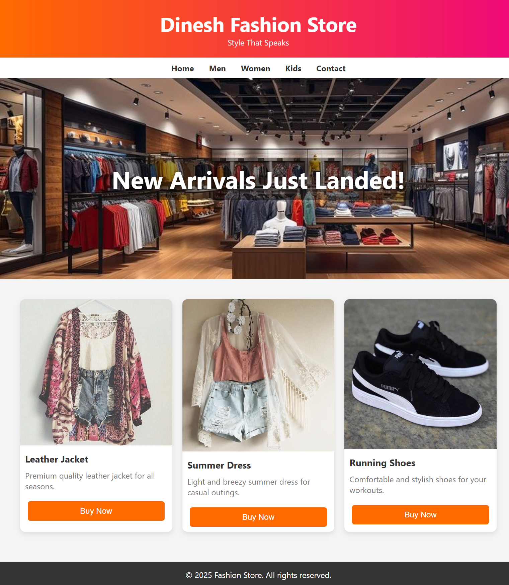   |
| Navbar Dark          | 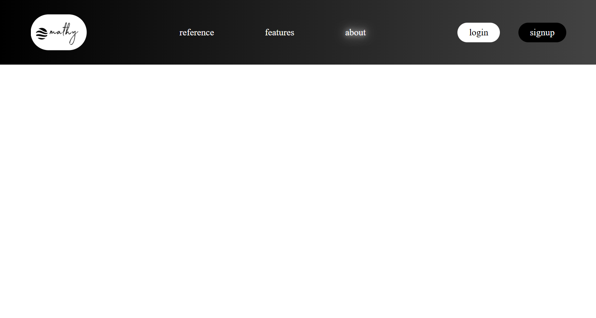       |
| Pricing Tag          | 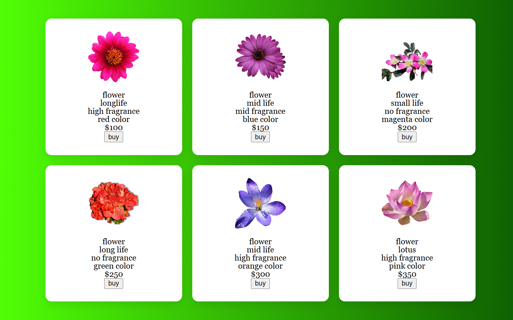       |
| Flexbox Landing Page | 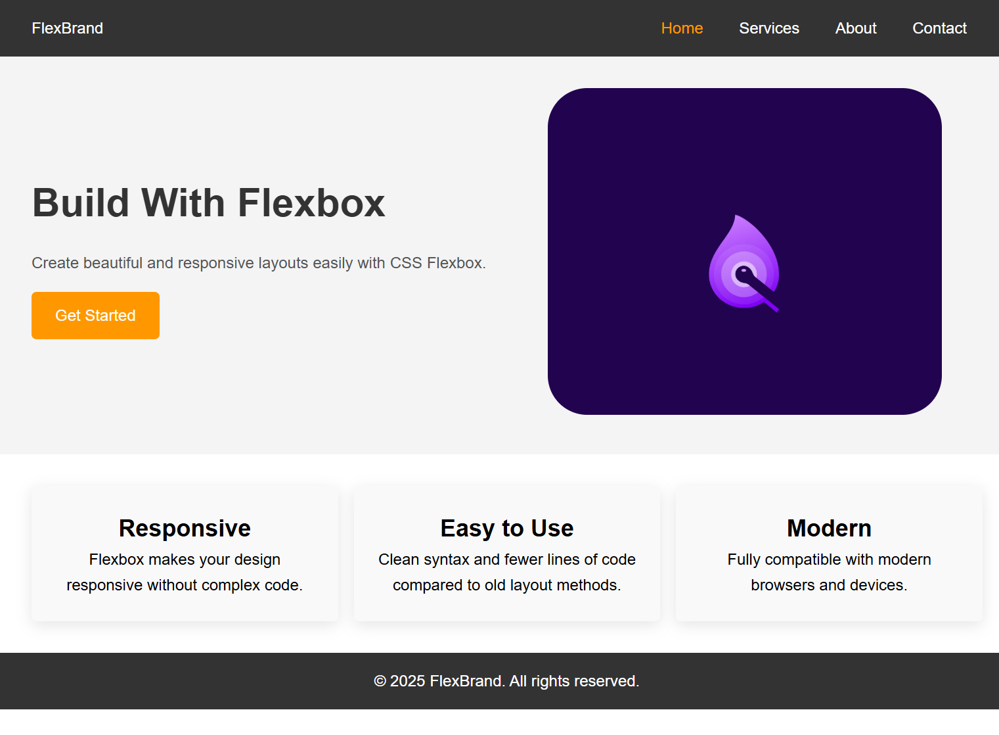 |
| Flexbox Landing Page 2| 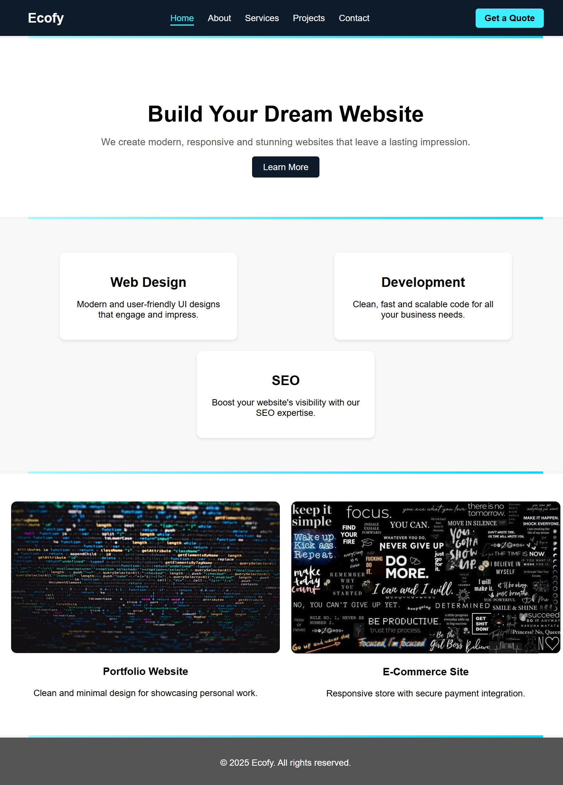 |
| Museum of Candy      | 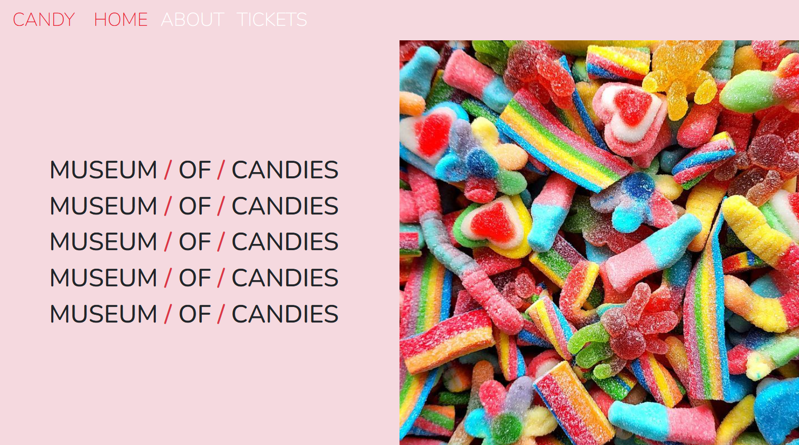|
| Basic Gallery        | 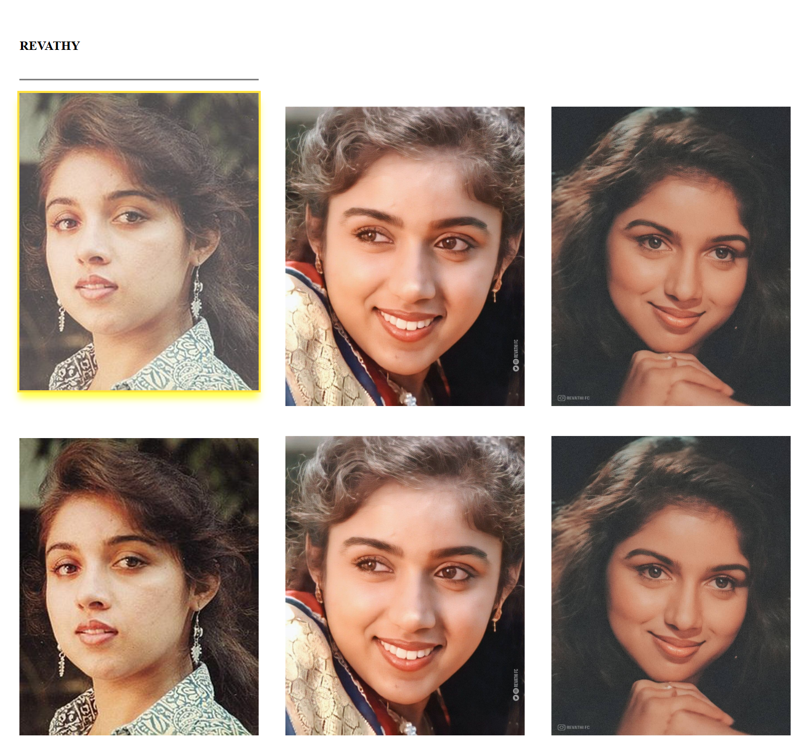   |
| Admin Dashboard      | .png)|
| Beginner Portfolio   | 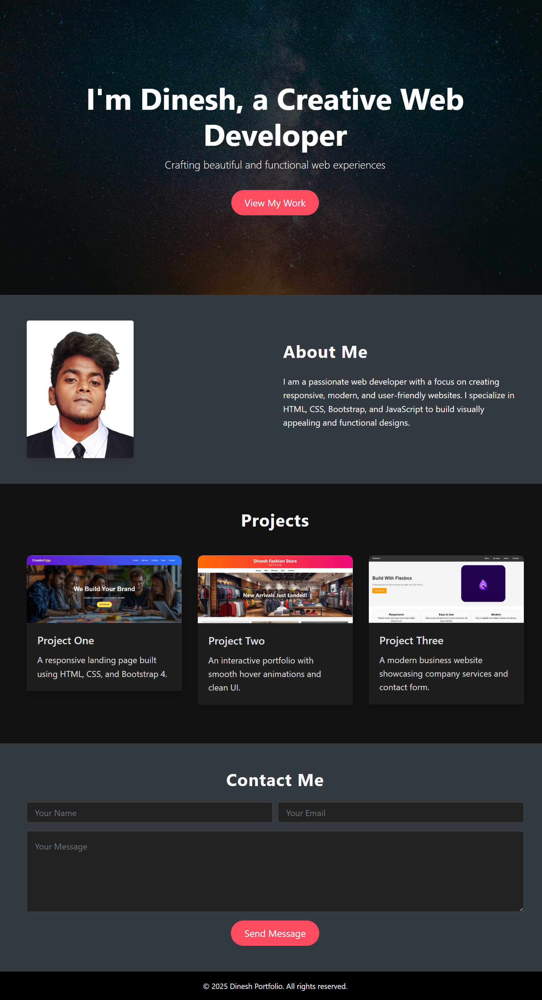 |
| Candy Baby           | 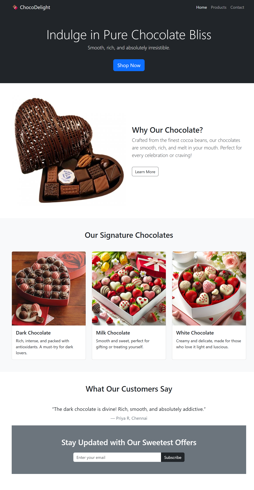         |
| Candy Baby 2         | 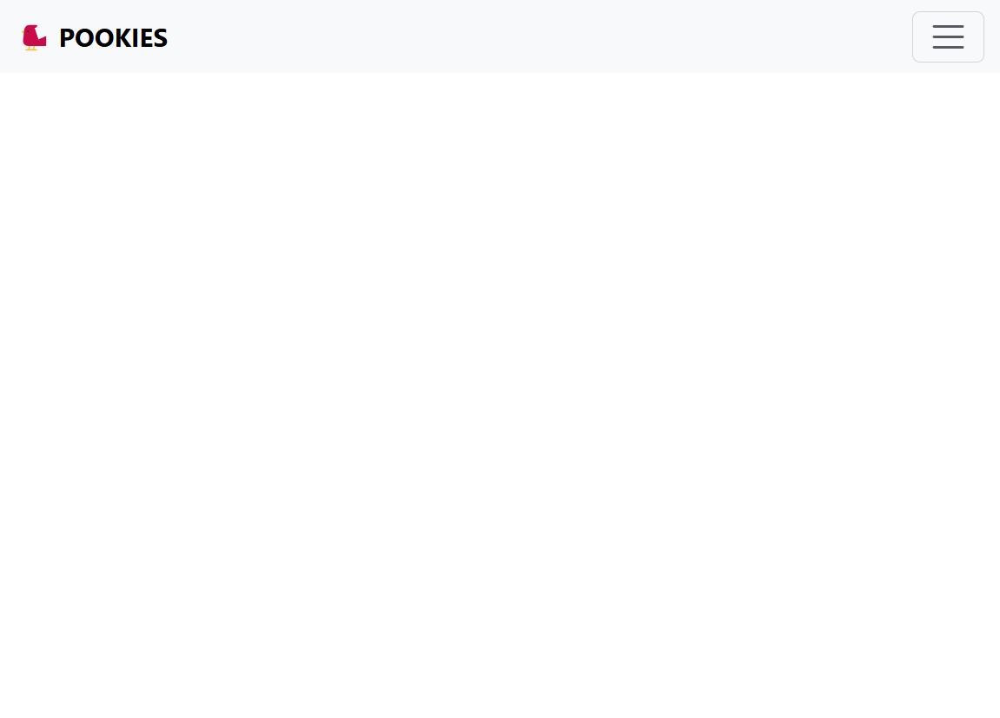      |
| HTML Project Two     | 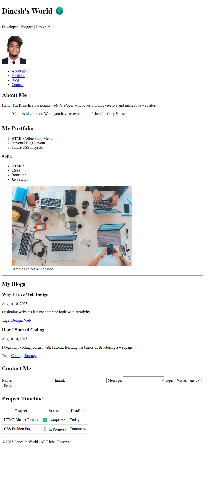 |
| HTML Project One     | 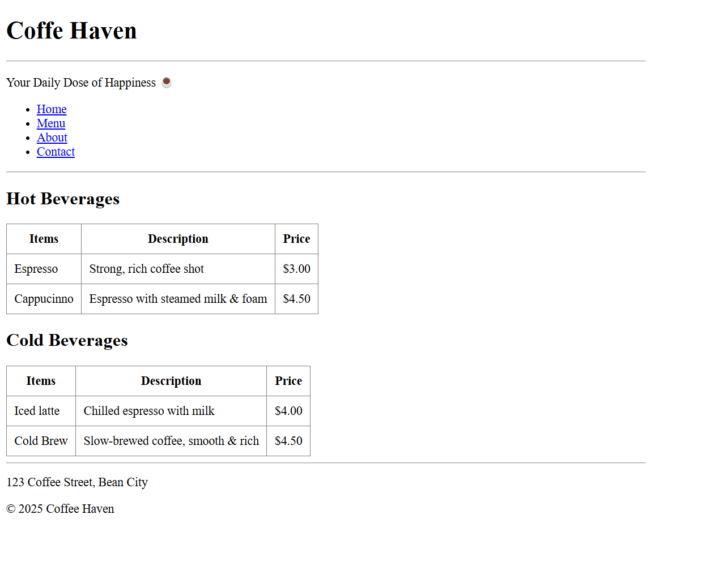 |

---

## 📬 Contact Me

Feel free to connect or reach out:

- GitHub: [dineshtm07](https://github.com/dineshtm07)  
- LinkedIn: [Your LinkedIn](https://linkedin.com/in/yourprofile)  
- Email: your.email@example.com

---

## 📄 License

This repository is licensed under the MIT License. See the [LICENSE](LICENSE) file for details.

---

## 🎯 View All My Projects

  

💡 **Tip:** Click the 🌐 "Live" link for each project to see it in action.
